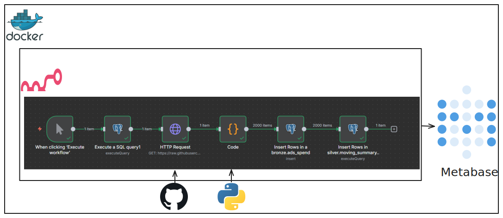

# __8 Figure : AI Data Engineering Assesment__

## __1. Overview__

This project demonstrates a data engineering workflow built for an assessment. It showcases skills in data ingestion via API, data transformation using Python, and data persistence in a multi-layered medallion architecture (Bronze, Silver, Gold). The entire ETL (Extract, Transform, Load) process is orchestrated and automated using n8n. The final aggregated metrics are stored in PostgreSQL and made available for visualization in Metabase.

## __2. Objective__
The goal is to evaluate the approach to data ingestion, modeling, and making metrics accessible. This is not intended to be a production-ready system but a clear demonstration of:

- __Data Engineering Thinking__: Architectural design and data modeling.

- __SQL Proficiency__: Complex query writing for data transformation and aggregation.

- __Automation Skills__: Using n8n to build a robust, scheduled data pipeline.


## __3. Architecture & Technology Stack__

### __3.1. Medallion Architecture__
The data is processed through three distinct layers, each serving a specific purpose:

- Bronze (Raw Layer): Stores the raw, unprocessed data as it was ingested from the source. The schema is applied, and basic data typing is enforced.

- Silver (Refined Layer): Contains cleaned, enriched, and transformed data. This layer often involves joining datasets and preparing data for business analysis.

- Gold (Aggregated Layer): Stores highly aggregated data, often in the form of business-level metrics, ready for consumption by dashboards and reports.

### __3.2. Tools & Technologies__
Component	Technology	Purpose
Orchestration	n8n	Workflow automation and pipeline orchestration.
Ingestion	n8n HTTP Request Node	Pulling raw CSV data from a remote source.
Transformation	n8n Code Node (Python)	Parsing, cleaning, and type casting raw data.
Persistence	PostgreSQL	Relational database for storing Bronze, Silver, and Gold layer tables.
Visualization	Metabase	Business Intelligence tool for exploring and visualizing the 


## __Workflow Architecture__
The project architecture is represented below:

In this architecture, `n8n` is used to orchestrate the data extraction via an HTTP request. Subsequently, data processing is done using Python. After that, the data is saved in a PostgreSQL database, which is structured following a Medallion architecture. Finally, Metabase is used as the data visualization tool.


## __Project Structure__
The project was structured as follows:

```
├── README.md
├── data
│   └── ads_spend.csv
├── data_transformation
│   ├── python
│   │   ├── convert_csv.py
│   │   └── read-data.ipynb
│   └── sql
│       ├── analysis_over_period.sql
│       ├── date_ranges.sql
│       └── ddl
│           ├── ads_spend_refined.sql
│           ├── create_schemas.sql
│           └── moving_sum_average.sql
├── docker-compose.yaml
├── img
│   ├── n8n_workflow.png
│   └── project_arch.svg
```

The `ads_spend.csv` file provided in the project description was added to the `data` folder. `data_transformations` contains all the code used for data processing. It is divided into SQL and Python, corresponding to the two languages used in this project. The `sql/ddl` folder holds the definition of the tables that will be used throughout the project.

## __Technologies Used__
- **n8n**: Used as the process orchestrator.
- **Docker**: Used for service containerization.
- **Postgres**: Used as the database to persist ETL data.
- **Metabase**: BI tool used for data exploration.

## __How to Reproduce the Project__

Clone the repository:

`git clone git@github.com:apfurlan/8-figure-data-engineer.git`

Navigate to the project directory:
`cd 8-figure-data-engineer`

Start the containers with Docker:
`docker-compose up -d`

Access n8n, Postgres, and Metabase at the following URLs:
- `http://localhost:5678`
- `http://localhost:5431`
- `http://localhost:3000`

respectively.

Stop and remove the Docker containers:

`docker-compose down -v`

## License
This project is licensed under the MIT License